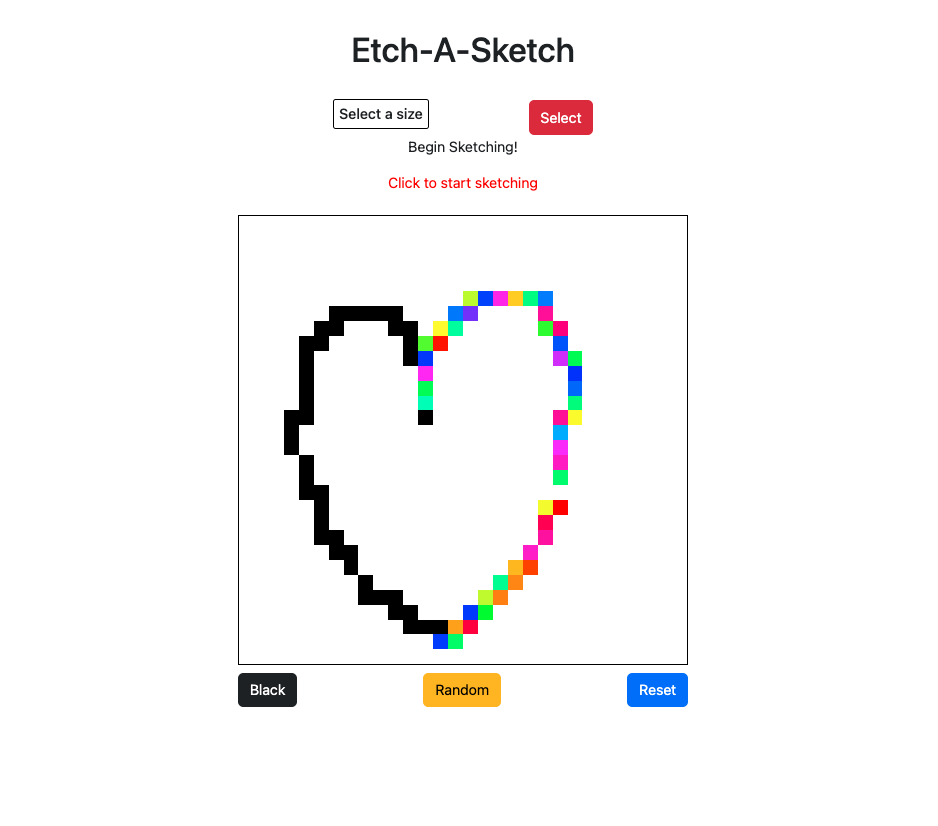

<h1 align="center">Etch-A-Sketch</h1>

   A Project from <a href="https://www.theodinproject.com/" target="_blank">The Odin Project</a>.

  <h3>
    <a href="https://globoivic.github.io/Etch-A-Sketch/">
      Demo
    </a>
     | 
    <a href="https://github.com/GloBoiVic/Etch-A-Sketch">
      Github Repo
    </a>
     | 
    <a href="https://www.theodinproject.com/lessons/foundations-etch-a-sketch">
      Project Description
    </a>
  </h3>

## :file_folder: Table of Contents

- [General Info](#general-information)
- [Technologies Used](#technologies-used)
- [Features](#features)
- [Screenshots](#screenshots)
- [Room for Improvement](#room-for-improvement)
- [Contact](#contact)

## :page_facing_up: General Information

My second project in The Odin Project Curriculum. \
It was difficult to start but I found this tutorial on [youtube](https://www.youtube.com/watch?v=0YjwdFT-O9Y&t=1557s) and followed it as a guide. \
I changed some stuff around but I plan to go back and refactor it. \
My priority right now is to get through the Odin Curriculum

Before starting this project, I felt lost and I took 7 hour JavaScript Crash Course on YouTube.
I was still confused!

This project in particular, I found writing DOM elements and manipulating the html and css with JavaScript challenging. \
Towards the end, I was able to grasp the concept. \
My concern is: Will I be able to duplicate this by myself without a tutorial as a guide? \
The struggles of a self-taught software developer...

## :computer: Technologies Used

- Html
- CSS
- JavaScript

## :fire: Features

The Etch-A-Sketch allows the user to "draw" using mouseover. \
The functionality to click to activate it neat; helps control the flow. \
The board also prompts the user to enter a size which creates a larger "sketch pad". \
Also, the random color button that allows the user to "draw" using random color is atypical.

## :camera: Screenshots

## :heavy_exclamation_mark: Room for Improvement

Continue learning how to manipulate DOM elements.
I also need to get better at understanding the project and plan effectively before undertaking it.

To improve this project, I would like to:

- Add an animated background feature
  - Update: I re-added the animated background and refactored the code to remove background clutter.
    - I refactored by clearing all the divs in the resetBoard function by setting it to empty.
    - Then I add the resetBoard function to the button that selects the size. This clears previous drawings
- Make the board size bigger
- Create a retro styled Etch-A-Sketch Board like back when I was a kid

## :bust_in_silhouette: Contact

- GitHub [@GloBoiVic](https://github.com/vicdatrader) - please reach out to me! I want to connect with other coders!
